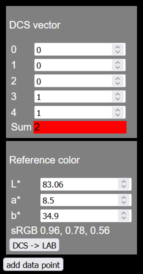
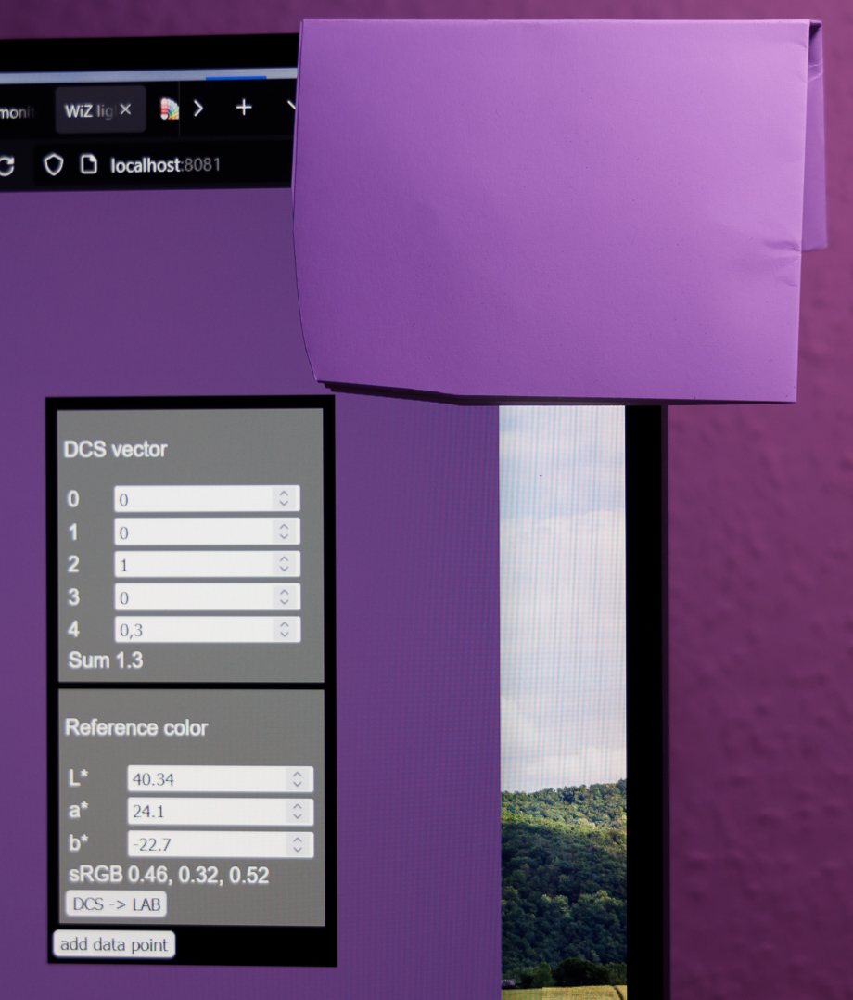

# Light device profiling tool

This tool provides helps you with creating color profiles for light devices.
The process is mostly manual, but it can be done quickly if you are good with matching colors by eye.

## Usage

### Prerequisites

- A calibrated and profiled computer screen.
- A web browser that is color managed.
- A light device that is supported by D3iot.

### Build

Build the executable with the go compiler from inside this directory.

``` shell
go build
```

### Initial set up

To create a color profile for a WiZ light device, start the profiling executable.

``` shell
profiling --device-wiz "wiz-123abc:38899" --max-luminance 1500
```

- `--device-wiz "wiz-123abc:38899"` will connect to a WiZ device by its name, you can also use its IP.
- `--max-luminance 1500` defines the max luminance in lumen. This should correspond with the luminance of your white point (first match you tune in).

Once the software is running, open a web-browser and visit [http://localhost:8081](http://localhost:8081).
You should see a page with the following controls:



- `DCS vector` describes the vector in linear device color space.
The components are in the range of [0, 1] and may represent R, G, B, cold white and warm white, but this depends on the specific device.

- `Reference color` is the color that is used as a reference.
The background of the webpage will be used as reference, you need to place something like a piece of paper on or near your screen to be able to compare the light output of the device with the reference.

- A red background of either the `Sum` value or the `sRGB` value signals that you are possibly outside of the range of either your light device or your screen.

Here is an example of how you can compare the reference to the emitted light.



### Matching colors

The first color you match has to be your device's white point, which is normally also the brightest color.
The exact DCS vector to get the brightest color depends on your device.
For a RGBCW device, you should set your vector to something like:

- 0: 0
- 1: 0
- 2: 0
- 3: 1
- 4: 1

Now you just have to tune the reference color until it matches the color of the light as closely as possible.
Use `add data point` to confirm a matching pair.

When you got your white point set you can dial in more or less random DCS vectors and tweak them again like in the previous step.

> :warning: To get good results don't change the distance of the light to your reference.
> Also, reduce, block or turn off other light sources.

Once the tool has created a color profile, you can use the `DCS -> LAB` button to determine the L\*a\*b\* color for any given DCS vector.
With the help of this you can quickly go through vectors, check the correctness of their color transformation, and apply corrections if you see color differences.
